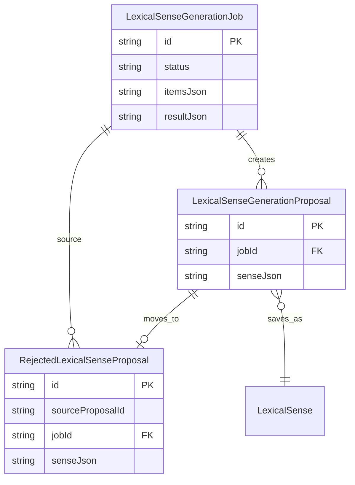

# Data model: asynchroniczne generowanie LexicalSense

```mermaid
erDiagram
  LexicalSenseGenerationJob ||--o{ LexicalSenseGenerationProposal : creates
  LexicalSenseGenerationJob ||--o{ RejectedLexicalSenseProposal : source
  LexicalSenseGenerationProposal ||--o| RejectedLexicalSenseProposal : moves_to
  LexicalSenseGenerationProposal }o--|| LexicalSense : saves_as
  LexicalSenseGenerationJob {
    string id PK
    string status
    string itemsJson
    string resultJson
  }
  LexicalSenseGenerationProposal {
    string id PK
    string jobId FK
    string senseJson
  }
  RejectedLexicalSenseProposal {
    string id PK
    string sourceProposalId
    string jobId FK
    string senseJson
  }
```

`saves_as` jest relacją biznesową w akcji zapisu, nie wymaganym FK po usunięciu pending proposal.
